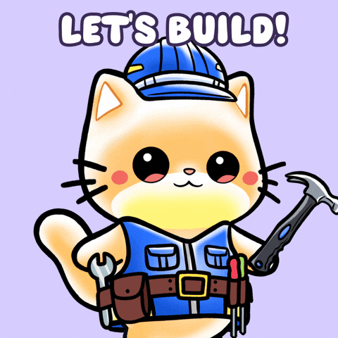

  

  

  🔥 Building scalable web & mobile apps with <strong>React Native/Expo</strong>, 
  <strong>Java/Android</strong> & <strong>TypeScript</strong> | PHP/Laravel | Open to collaborations

<h3>🚀 Core Tech Stack</h3>

  

